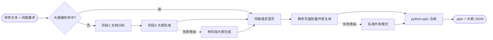

# Agentic-PPT

<div align="center">

**文本 → 专业级 PPT 的智能演示文稿 Agent**

基于 LLM 大纲生成 + Gemini 图像渲染，把一段参考文本快速转化为逻辑清晰、视觉统一的 PowerPoint。适用于商业路演、学术报告、产品发布等各种场景。

[](LICENSE)
[](https://www.python.org/)
[](https://platform.openai.com/docs/api-reference)
[](https://aistudio.google.com/)
[](#贡献)

[项目简介](#项目简介) • [工作流程](#工作流程) • [核心特性](#核心特性) • [快速开始](#快速开始) • [配置说明](#配置说明) • [模板预设](#模板预设) • [自定义模板](#自定义模板) • [高级用法](#高级用法) • [常见问题](#常见问题) • [路线图](#路线图)

</div>

---

## 项目简介

**Agentic-PPT**（v2.0.0）是一个智能 PPT 生成 Agent。你提供一段参考文本和风格要求，它自动完成从内容理解到成品演示文稿的全流程：

1. **理解** — 借鉴 NotebookLM 的两阶段理念，先深度分析文档结构，再生成精准大纲；
2. **设计** — 借鉴 Nano Banana Pro 的风格锚定理念，先由首页确定整体视觉风格，后续页面严格保持一致；
3. **合成** — 将生成的幻灯片图片组装为 16:9 的 `.pptx` 文件，同时输出结构化大纲 JSON。

> **关于图像生成后端**：本项目内部版本使用 Nano Banana Pro 服务（自有平台接入），因无法公开，开源版本改用 **Google Gemini 官方 API** 实现相同接口（[ppt_generator/slide_generator_official.py](ppt_generator/slide_generator_official.py)）。开源版本仍在持续打磨，生成效果如有波动，欢迎社区一起改进。

---

## 工作流程



### 核心组件

| 模块 | 职责 |
|------|------|
| `outline_generator.py` | 两阶段大纲生成（文档分析 → 结构化 JSON 大纲），含验证修复与降级 |
| `document_analyzer.py` | 文档分析器：识别文档类型、主题、关键章节、数据点与推荐叙事结构 |
| `batch_generator.py` | 风格锚定批量图片生成，按页面类型分组并发 |
| `slide_generator_official.py` | 基于 Google Gemini 的幻灯片图片生成（含专业 Prompt 模板） |
| `template_loader.py` | YAML 模板预设加载，支持热更新 |
| `cache_manager.py` | 大纲与图片缓存（SHA-256 键值，默认 7 天 TTL） |
| `error_handler.py` | 智能错误处理：敏感词替换、Prompt 简化、指数退避、降级方案 |

---

## 核心特性

| 特性 | 说明 |
|------|------|
| **两阶段大纲生成** | 先分析文档结构，再生成大纲，逻辑更贴合原文（失败自动降级为单阶段） |
| **风格锚定批量生成** | 首页确定视觉风格，后续页面严格锚定，全篇视觉统一 |
| **智能错误处理** | 内容策略违规自动替换敏感词、超时简化 Prompt、限流指数退避，多级降级策略 |
| **智能缓存机制** | 大纲与图片双缓存，相同内容重复生成零成本 |
| **23 种模板预设** | 从商务到时尚，一键切换风格 |
| **自定义模板** | 通过 YAML 文件轻松创建自己的模板，无需改代码 |
| **多提供商 LLM** | DeepSeek / OpenAI / Claude 任意切换，兼容 OpenAI 协议的自定义端点 |
| **中文渲染优化** | 针对中文排版的专业 Prompt 工程，避免乱码与模糊 |

---

## 快速开始

### 环境要求

- Python 3.8+
- 一个 LLM API Key（推荐 [DeepSeek](https://platform.deepseek.com/)，也可使用 OpenAI 或 Claude）
- 一个 [Google Gemini API Key](https://aistudio.google.com/app/apikey)（用于幻灯片图片生成）

### 安装

```bash
# 克隆仓库
git clone https://github.com/MinJung-Go/Agentic-PPT.git
cd Agentic-PPT

# 安装依赖
pip install -r requirements.txt
```

### 配置环境变量

```bash
cp .env.example .env
```

编辑 `.env`，填入你的 API Key：

```env
DEEPSEEK_API_KEY=your-deepseek-key
GEMINI_API_KEY=your-gemini-key
```

### 运行示例

```bash
python example.py
```

程序进入交互模式，内置 5 个示例内容（AI 技术、商业计划、生活美学、产品发布、学术研究），选择模板编号与内容编号即可生成 PPT。

### 代码使用

```python
import os
from ppt_generator import PPTGenerator

# 创建生成器（provider 传入任意值即走 OpenAI 兼容协议，可对接 DeepSeek）
generator = PPTGenerator(
    api_key=os.getenv("DEEPSEEK_API_KEY"),
    provider="deepseek",
    base_url="https://api.deepseek.com/v1"
)

# 生成 PPT
result = generator.generate_ppt(
    reference_text="你的内容文本...",
    style_requirements="科技风格，蓝色主题...",
    output_dir="output",
    template_preset="business_pitch"   # 可选：模板预设
)

print(f"生成完成: {result['pptx_file']}")
print(f"成功 {result['success_slides']}/{result['total_slides']} 页")
```

---

## 配置说明

### 环境变量

| 变量 | 必填 | 说明 |
|------|:----:|------|
| `DEEPSEEK_API_KEY` | 三选一 | DeepSeek API 密钥（由 `example.py` 读取，推荐） |
| `OPENAI_API_KEY` | 三选一 | OpenAI API 密钥（由统一客户端读取） |
| `ANTHROPIC_API_KEY` | 三选一 | Claude API 密钥（由统一客户端读取） |
| `GEMINI_API_KEY` | 是 | Gemini API 密钥（图片生成必需），获取地址：https://aistudio.google.com/app/apikey |

> `.env.example` 中还包含 `GEMINI_IMAGE_MODEL`、`CACHE_DIR`、`LOG_LEVEL` 等预留项，当前版本尚未在代码中读取，请勿依赖。

### LLM 提供商切换

`PPTGenerator` 的 `provider` 参数支持三种方式：

| 传值 | 行为 |
|------|------|
| `"Claude"` | 使用 Anthropic SDK 调用 Claude 模型 |
| `"Openai"` | 使用 OpenAI SDK，可自定义 `base_url` |
| 其他任意值（如 `"deepseek"`） | 统一客户端自动检测，任何 OpenAI 协议兼容端点均可接入 |

`model` 参数默认 `deepseek-chat`，传入其他模型名（如 `gpt-4`、`claude-3-5-sonnet`）即可切换。

---

## 模板预设

内置 23 种模板预设，位于 [configs/templates/](configs/templates/) 目录，分为三大类：

### 经典商务

| 预设名称 | 中文名称 | 适用场景 |
|---------|---------|---------|
| `business_pitch` | 商业路演 | 融资演示、产品推介、商业计划书 |
| `technical_report` | 技术报告 | 技术分享、研究汇报、项目总结 |
| `product_launch` | 产品发布 | 新品发布会、功能演示、产品介绍 |
| `training` | 培训课程 | 内部培训、教学演示、知识分享 |
| `quarterly_review` | 季度汇报 | 业绩汇报、工作总结、部门复盘 |
| `project_proposal` | 项目提案 | 项目立项、方案提案、需求评审 |
| `company_intro` | 公司介绍 | 企业宣传、合作洽谈、招聘宣讲 |
| `academic` | 学术演讲 | 学术会议、论文答辩、研究报告 |

### 时尚风格

| 预设名称 | 中文名称 | 风格特点 |
|---------|---------|---------|
| `minimal_luxury` | 极简高级 | Apple 风格，大量留白，极致简约 |
| `kawaii_cute` | 可爱少女 | 粉嫩甜美风，圆角卡片，可爱插画 |
| `cyberpunk` | 赛博朋克 | 霓虹灯效果，暗黑背景，未来科技感 |
| `morandi` | 莫兰迪色 | 低饱和度高级灰，温柔优雅 |
| `chinese_modern` | 新中式 | 国潮风格，水墨元素 |
| `magazine` | 杂志风 | Editorial 设计，大胆字体 |
| `glassmorphism` | 玻璃拟态 | 毛玻璃效果，现代 UI 风格 |
| `doodle` | 手绘涂鸦 | 手绘风格，趣味活泼 |
| `3d_modern` | 3D 立体 | 立体图形，悬浮卡片 |
| `vintage` | 复古怀旧 | 复古色调，文艺风 |

### 特色场景

| 预设名称 | 中文名称 | 风格特点 |
|---------|---------|---------|
| `academic_paper` | 学术论文风 | 清爽学术感，适合论文解读 |
| `xiaohongshu` | 小红书风 | 种草笔记风格，粉嫩配色 |
| `instagram` | INS 风 | 欧美博主风格，高级滤镜感 |
| `tech_launch` | 科技发布会 | Apple/小米发布会风格 |
| `muji_minimal` | 日系清新 | MUJI 风格，原木色调 |

---

## 自定义模板

在 `configs/templates/` 目录下添加 YAML 文件即可创建自定义模板：

```yaml
# configs/templates/my_template.yaml
name: "我的模板"
description: "模板描述"
sequence:
  - title
  - content
  - data_dashboard
  - conclusion_cta
narrative: "problem_solution_result"
suggested_slides: 4

style_hints:          # 可选：风格提示，会以最高优先级注入图片生成 Prompt
  background: "深蓝色渐变背景"
  typography: "现代无衬线字体，标题加粗"
  colors:
    - "#1a1a2e"
    - "#16213e"
    - "#0f3460"
    - "#e94560"
  layout: "左文右图，留白充足"
  visual: "科技感图标，数据可视化"
```

使用自定义模板：

```python
result = generator.generate_ppt(
    reference_text=your_text,
    style_requirements=your_style,
    template_preset="my_template"    # 对应 my_template.yaml
)
```

### 可用的页面类型

`sequence` 中可使用以下页面类型：

| 类型 | 说明 |
|-----|------|
| `title` | 标题页 |
| `toc` | 目录页 |
| `content` | 标准内容页 |
| `problem_solution` | 问题-解决方案对比页 |
| `data_dashboard` | 数据仪表盘 |
| `timeline` | 时间轴 |
| `comparison` | 对比页 |
| `case_study` | 案例研究 |
| `conclusion_cta` | 总结/行动号召 |

---

## 高级用法

### generate_ppt 完整参数

| 参数 | 默认值 | 说明 |
|------|--------|------|
| `reference_text` | —（必填） | 参考文本 |
| `style_requirements` | —（必填） | 风格要求（自然语言描述） |
| `output_dir` | `"output"` | 输出目录 |
| `model` | `"deepseek-chat"` | 大纲生成使用的模型 |
| `audience_profile` | `None` | 目标受众信息（type / expertise / interests） |
| `brand_guidelines` | `None` | 品牌规范（primary_color / secondary_color / style） |
| `brand_references` | `None` | 品牌参考图路径列表（最多 14 张） |
| `use_cache` | `True` | 是否使用缓存 |
| `template_preset` | `None` | 模板预设名称 |

> 异步场景推荐使用 `generate_ppt_async()`，支持 `max_concurrent` 参数控制并发数（默认 4）。

### 缓存管理

```python
# 查看缓存统计
stats = generator.get_cache_stats()
print(f"大纲缓存: {stats['outline_count']} 个")
print(f"图片缓存: {stats['image_count']} 个")
print(f"总大小: {stats['total_size_mb']} MB")

# 清除过期缓存（过期时间由缓存 TTL 决定，默认 7 天）
generator.clear_cache(older_than_days=7)

# 清空所有缓存
generator.clear_cache()
```

### 热加载模板

```python
from ppt_generator.template_loader import reload_templates

# 修改 YAML 文件后，重新加载
reload_templates()
```

### 生成结果

`generate_ppt()` 返回字典，包含：

| 字段 | 说明 |
|------|------|
| `pptx_file` | 生成的 .pptx 文件路径 |
| `outline_file` | 结构化大纲 JSON 路径 |
| `total_slides` / `success_slides` | 总页数 / 成功页数 |
| `error_slides` | 失败页面列表（失败页会以红色错误占位页写入 PPT） |
| `generation_info` | 生成模式信息（两阶段 / 风格锚定 / 缓存命中） |
| `cache_hits` | 图片缓存命中数（有命中时返回） |

---

## 图片生成说明

幻灯片图片由 Google Gemini 生成（[ppt_generator/slide_generator_official.py](ppt_generator/slide_generator_official.py)）：

- **模型**：默认 `gemini-3-pro-image-preview`（Nano Banana Pro，高质量、支持 4K）；可通过 `ImageGenerationTool(api_key=..., model=...)` 参数切换为 `gemini-2.5-flash-image`（Nano Banana，快速、性价比高）；
- **规格**：16:9 宽高比，`2K` 分辨率（Pro 模型支持 `4K`）；
- **Prompt 工程**：内置专业 Prompt 模板，确保布局合理、中文渲染清晰、页码位置统一；
- **容错**：单页最多重试 3 次，指数退避；失败页面自动降级为错误占位页，不影响整体产出。

---

## 项目结构

```
Agentic-PPT/
├── configs/
│   └── templates/                  # YAML 模板配置文件（23 个内置模板）
├── ppt_generator/
│   ├── __init__.py                 # 主入口，PPTGenerator 类
│   ├── outline_generator.py        # 两阶段大纲生成
│   ├── document_analyzer.py        # 文档分析器
│   ├── slide_generator_official.py # 幻灯片图片生成（Google Gemini）
│   ├── batch_generator.py          # 批量生成（风格锚定）
│   ├── prompt_templates.py         # Prompt 模板系统
│   ├── template_loader.py          # YAML 模板加载器
│   ├── cache_manager.py            # 缓存管理
│   ├── error_handler.py            # 智能错误处理
│   └── claude_client.py            # 统一 AI 客户端（OpenAI / Claude 协议）
├── example.py                      # 交互式示例（含 5 个示例内容）
├── requirements.txt                # 依赖列表
├── .env.example                    # 环境变量示例
└── README.md
```

---

## 常见问题

<details>
<summary><b>Q: 需要哪些 API Key？</b></summary>

**A:** 两类：一个 LLM Key（`DEEPSEEK_API_KEY` / `OPENAI_API_KEY` / `ANTHROPIC_API_KEY` 三选一，用于大纲生成）和一个 `GEMINI_API_KEY`（用于幻灯片图片生成，[免费获取](https://aistudio.google.com/app/apikey)）。
</details>

<details>
<summary><b>Q: 支持其他图片生成服务吗？</b></summary>

**A:** 目前开源版本仅支持 Google Gemini 官方 API。如果你需要接入其他服务（如 Nano Banana Pro、即梦、通义万相等），只需实现 `ImageGenerationTool` 的相同接口即可替换，批量生成与错误处理层无需改动。
</details>

<details>
<summary><b>Q: 生成一页失败会影响整个 PPT 吗？</b></summary>

**A:** 不会。失败页面会自动降级为红色错误占位页写入 PPT（包含页码、标题和错误信息），其余页面正常生成。错误详情同时记录在返回值的 `error_slides` 字段中。
</details>

<details>
<summary><b>Q: 生成成本如何控制？</b></summary>

**A:** 三个手段：一是大纲与图片缓存，相同内容重复生成零 API 成本；二是通过 `ImageGenerationTool` 的 `model` 参数切换为快速模型 `gemini-2.5-flash-image`；三是使用 `max_concurrent` 控制并发，避免限流重试。
</details>

<details>
<summary><b>Q: 有移动端 / 图形界面版本吗？</b></summary>

**A:** 有。本仓库的 `flutter-apk` 分支提供 Flutter 移动端应用（支持 GLM API 与本地历史记录），本分支为 Python 核心库版本，两者可独立使用。
</details>

<details>
<summary><b>Q: 支持上传品牌参考图吗？</b></summary>

**A:** `brand_references` 参数已支持传入参考图路径列表（最多 14 张），目前以文字描述形式注入生成 Prompt；图片内容的直接参考（视觉特征提取）在[路线图](#路线图)中。
</details>

---

## 路线图

- [x] 更多模板预设 - ins 风、小红书风、学术论文风等（共 23 种）
- [x] 自定义模板 - 支持用户通过 YAML 定义自己的模板
- [x] 智能缓存 - 大纲与图片缓存，重复生成零成本
- [x] 智能错误处理与多级降级
- [ ] 增量更新 - 只重新生成内容发生变化的页面（能力已就绪，待接入生成流水线）
- [ ] 参考图片风格生成 - 上传参考图片，AI 提取并生成相似风格
- [ ] 实时预览 - 生成过程中实时预览效果
- [ ] 多语言支持 - 英文、日文等多语言优化
- [ ] 导出格式 - 支持导出为 PDF、图片序列等
- [ ] 演讲者备注 - 自动生成演讲稿和备注

欢迎通过 Issue 提出新的想法，或直接提交 PR！

---

## 贡献

欢迎各种形式的贡献！包括但不限于：

- 报告 Bug 或提出新功能（[Issue](https://github.com/MinJung-Go/Agentic-PPT/issues)）
- 改进 Prompt 工程与生成质量
- 完善文档
- 修复代码问题

提交 PR 前请确保：

1. 代码风格与现有代码保持一致；
2. 修改前先阅读相关模块的注释与设计意图；
3. 在 PR 描述中说明改动动机与效果。

---

## 许可证

本项目采用 [Apache License 2.0](LICENSE) 开源。

---

## 致谢

- [NotebookLM](https://notebooklm.google.com/) — 两阶段大纲生成理念
- [Nano Banana Pro](https://ai.google.dev/) — 风格锚定批量生成理念
- [Google Gemini API](https://aistudio.google.com/) — 幻灯片图片生成
- [python-pptx](https://python-pptx.readthedocs.io/) — PPT 文件合成
- [Pydantic](https://docs.pydantic.dev/) — 参数验证
- [DeepSeek](https://www.deepseek.com/) — 默认 LLM 服务商

---

<div align="center">

**如果这个项目对你有帮助，欢迎给个 Star！**

如有问题或建议，欢迎提交 [Issue](https://github.com/MinJung-Go/Agentic-PPT/issues)

Made by [MinJung-Go](https://github.com/MinJung-Go)

</div>
